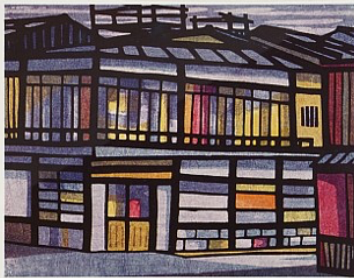

<figure class="hero"></figure>

# Transformer

### Overview
A common problem in data analysis is that the data is messy.  Cleaning messy data is difficult and often requires technical skills.  Trifacta enables analysts to clean and prepare their data by providing them with a visual cleaning experience powered by machine learning.

The process of cleaning data in Trifacta had been tailored to data scientists, closely resembling a scripting language, making the cleaning process unnecessarily hard for analysts.

Over a year and half we completely redesigned the core experience, replacing the technical scripting interaction model with an assistive and visual interaction model based on workflows, interfaces, and concepts tailored to analysts.

### Problem
<figure></figure>

There were many problems stemming from the fact that the interaction model was based on scripting with a Trifacta-specific language:

-The language was difficult for analysts to understand because it was too technical and Trifacta-specific.
-Learning the language was hard because there wasn’t any documentation or help in context.
-Common functionality was difficult fo find, such as using a formula, because it was nested under obscure Trifacta-specfic commands.
-Page layout was fractured, causing confusion and dead space.
-Visual design and basic interface components needed updating (covered in the Design System case study).

### Goals
Given the problems, the main goals of the project were to:
- Rethink the transformation crafting and editing experience for analysts by moving away from a scripting interaction model
- Improve discoverability and learnability of commands
- Redesign page layout and interactions to facilitate a better workflow

### Approach
Explore

Layout

### Final Design

The final design was a completely new cleaning experience for data analysts.

The Builder simplified the complex tasks of cleaning by allowing users to start where they feel comfortable, whether it be browsing options or crafting a specific cleaning command, assisting them during the process of creation by providing help in context. The panel proved to be a robust layout solution, creating a unified, focused experience.

The flexibility and assistance of the Builder broke the confines of the rigid scripting language and catered to the user’s mental model rather than forcing them into an experience oriented around a technical system.

### Impact
Something

[Next Case Study](/something)
